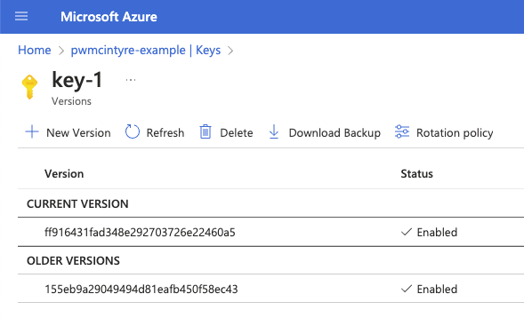

# Example Azure Key Vault

https://learn.microsoft.com/en-us/azure/security/fundamentals/encryption-atrest

## Deploy

```shell
terraform apply --input=false
```

## Run


```shell
npm install
npx esr ./index.ts
```

## Example run

With a new key:

```
$ npx esr .
{
  plaintext: 'Hello, World!',
  encrypted: {
    value: 'GPa5V/ogRtits6KzDtT/jA==',
    encrypted_data_key: 'xtorRUhFbrq5xhgl/Qlt3syHvgH2B7ky9NevSQuU11BbjhgG/Ld/eZuRnlK/e38+shMN90PIBrQHzqDjI7sWvZF9++EIjRK/dTjNPXauVxHOdvvOci7wA/7z1GesL8Id2QpMP1m6Ss4ctN5sItuf5AXcWOc99K+kvwOXhIszON/YToNFhQ7ODK/vwOf3FroPx1tNpSuW67Pm5A0/Y+d3q7mTVdfznEGOGxqlJrSzLL7XpsJ69Y/szHpnBJ5gFPvsNinE53GdqPTPaEWl7jBXK125OcXRCOd+Oern5OuH3wwjlnrLn6sV8DRlMDIU1h8skYq9Uigs9GC+Bwr/egUYlg==',
    encrypted_data_key_alg: 'RSA1_5',
    key_url: 'https://pwmcintyre-example.vault.azure.net/keys/key-1/155eb9a29049494d81eafb450f58ec43'
  },
  decrypted: 'Hello, World!'
}
```

and after rotation:



```
$ npx esr .
{
  plaintext: 'Hello, World!',
  encrypted: {
    value: 'bzD/BzorFIQTg4oDZ2FzlQ==',
    encrypted_data_key: 'jYGaoDgIMHzSe4kewPsuxUoYZaLe2MAZHRO5E5nLzUiBwxwEwaRvZI4fz3sUvzWIW6iCye9RCS41QqXTwrzVMpuycW4NqFJUnxk5p8JQEU6GwxeSzKI0liT961bWL+Xav7Zqkwfh8QvgUhArmOFO2okQLLlzLfMl2KyzyYB7Qthn2Iokeh+scOhkffVXozVsrfhOI6uIUoUlQyer+dM6t0Hg4BcSXI/ZYWG4BCLTvUdhyqqpsMG6cw9ViQLrwA8vfCU6S42svXj58PZ5hqSgE8/gBpMx0JK3jyjgoZuDm3OV4vbxGBkpkKcngSJom9b1bHJZg7j+yZYTxUF3Aq8pYg==',
    encrypted_data_key_alg: 'RSA1_5',
    key_url: 'https://pwmcintyre-example.vault.azure.net/keys/key-1/ff916431fad348e292703726e22460a5'
  },
  decrypted: 'Hello, World!'
}
```
