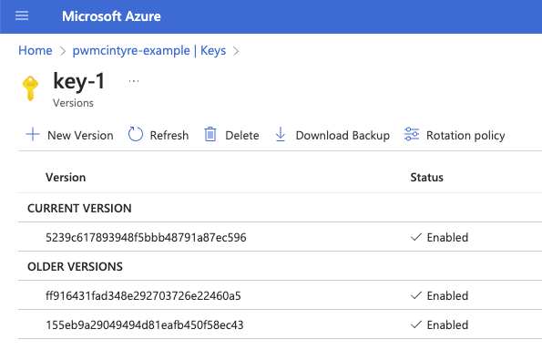

# Example Azure Key Vault

https://learn.microsoft.com/en-us/azure/security/fundamentals/encryption-atrest

## Deploy

```shell
terraform apply --input=false
```

## Run


```shell
npm install
npx npx esr ./src
```

## Example run

You can see the first attempt takes about 6 seconds per wrap and unwrap operation.

The Data Encryption Keys are cached for subsequent attempts.

```
$ npx esr ./src
encrypt: 6.791s
decrypt: 10.858s
success {
  plaintext: 'Hello, World!',
  encrypted: {
    value: 'dLa8Xxvs7pcCl4NlXqoQNQ==',
    encrypted_data_key_alg: 'RSA1_5',
    encrypted_data_key: 'HWqjfHAjMYX++w2U5MgM1/YMm4/fXDyyV1QB3d38aYkWWwNtal5442wYcASTCGiarXXneuhkVfKBzqKylg42e1q4OIzQvSiUXi3uCfKocxiF3RvFf898iKh3jpZunXGxXNQax319E6VzFyDHO1fMjeBBHRDfWnYmuVXZ7QEIAAdWOD+ClL5CMhJQcc1NOKYpafxX9dRLw6GCqYZ8T1jvTyb9aSlnkiA7m5wu1YHBSgj7QAeXTsNrvMbzgXSjwwiYDsQFMKgzjZxbOtY7RGvAc3Sa+7boj31De33hNf8295XfGBEKSkpmGf9QzFJAjvu3LaauoVEE9g5hMoE3psUrfg==',
    key_url: 'https://pwmcintyre-example.vault.azure.net/keys/key-1/ff916431fad348e292703726e22460a5'
  },
  decrypted: 'Hello, World!'
}
encrypt: 0.038ms
decrypt: 0.025ms
success {
  plaintext: 'Hello, World!',
  encrypted: {
    value: 'dLa8Xxvs7pcCl4NlXqoQNQ==',
    encrypted_data_key_alg: 'RSA1_5',
    encrypted_data_key: 'HWqjfHAjMYX++w2U5MgM1/YMm4/fXDyyV1QB3d38aYkWWwNtal5442wYcASTCGiarXXneuhkVfKBzqKylg42e1q4OIzQvSiUXi3uCfKocxiF3RvFf898iKh3jpZunXGxXNQax319E6VzFyDHO1fMjeBBHRDfWnYmuVXZ7QEIAAdWOD+ClL5CMhJQcc1NOKYpafxX9dRLw6GCqYZ8T1jvTyb9aSlnkiA7m5wu1YHBSgj7QAeXTsNrvMbzgXSjwwiYDsQFMKgzjZxbOtY7RGvAc3Sa+7boj31De33hNf8295XfGBEKSkpmGf9QzFJAjvu3LaauoVEE9g5hMoE3psUrfg==',
    key_url: 'https://pwmcintyre-example.vault.azure.net/keys/key-1/ff916431fad348e292703726e22460a5'
  },
  decrypted: 'Hello, World!'
}
```

and after rotation:



```
$ npx esr ./src                                  
encrypt: 6.909s
decrypt: 13.146s
success {
  plaintext: 'Hello, World!',
  encrypted: {
    value: 'wBLWmAoAwRFrCiOnu23qUg==',
    encrypted_data_key_alg: 'RSA1_5',
    encrypted_data_key: 'Ck6DQKv+/XyZq3TwoNXf+yfKsrlC2N8z6Ht+mf97u5T46K3Ymy5ee/VH1Aat61gBwNXq5Bcm2jjgWRoDmBATi4xXU1gqyt5EVKNQnNryY3X0nUnHCQ3GhW2c2iW2CjiwxFie8uMxbgio0LX4eBq2MhghzIo/I45iap1qR2Mf3V/nY38KOZ+wPG2maUbcGGF1c41ZY6+S9s78IR7xlNpJUYRW1+4h10zUSO/gSS0a149TWSPkBYfs1dp8djJOrxT8S+G84lhr0SRtNgQZvgePfM5H3C1SZSn1LqeNJZSMd+OmpihSUy1HnPtaskfLgWxGIpWdEzi9TaG6XTF9nmWZ4w==',
    key_url: 'https://pwmcintyre-example.vault.azure.net/keys/key-1/5239c617893948f5bbb48791a87ec596'
  },
  decrypted: 'Hello, World!'
}
encrypt: 0.231ms
decrypt: 0.075ms
success {
  plaintext: 'Hello, World!',
  encrypted: {
    value: 'wBLWmAoAwRFrCiOnu23qUg==',
    encrypted_data_key_alg: 'RSA1_5',
    encrypted_data_key: 'Ck6DQKv+/XyZq3TwoNXf+yfKsrlC2N8z6Ht+mf97u5T46K3Ymy5ee/VH1Aat61gBwNXq5Bcm2jjgWRoDmBATi4xXU1gqyt5EVKNQnNryY3X0nUnHCQ3GhW2c2iW2CjiwxFie8uMxbgio0LX4eBq2MhghzIo/I45iap1qR2Mf3V/nY38KOZ+wPG2maUbcGGF1c41ZY6+S9s78IR7xlNpJUYRW1+4h10zUSO/gSS0a149TWSPkBYfs1dp8djJOrxT8S+G84lhr0SRtNgQZvgePfM5H3C1SZSn1LqeNJZSMd+OmpihSUy1HnPtaskfLgWxGIpWdEzi9TaG6XTF9nmWZ4w==',
    key_url: 'https://pwmcintyre-example.vault.azure.net/keys/key-1/5239c617893948f5bbb48791a87ec596'
  },
  decrypted: 'Hello, World!'
}
```
